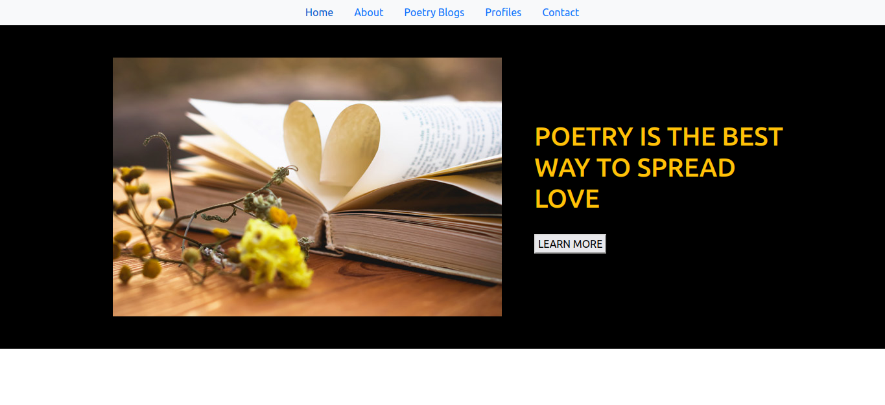
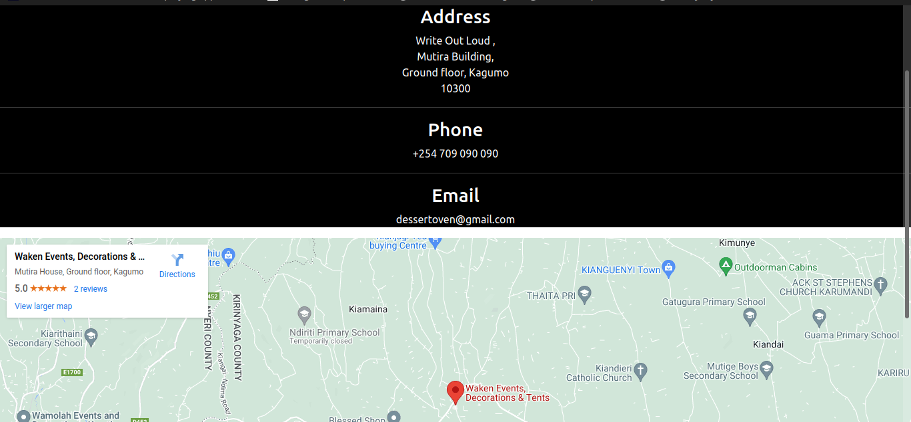

### API documentation
https://docs.google.com/document/d/12tnN_YsNtlxVc3M_ZcT0y7T75NORBNb9XtT3ZxoVIS8/edit?usp=sharing

### Backend github repository
https://github.com/ActuaryEmma/phase-3-sinatra-react-project

### REQUIREMENTS
Your react applications must at least include but not limited to:
Two(2) custom hooks.
Five (5) routes.
For all your components, have at most; 50% of them being stateful. (Ensure you lift state as much as possible)

### 
The Application is a single page app that has list of Poems where users can comment on each poem . 
The App has 5 components i.e Home , About , Contact , Profiles and Poetry Blogs.

### Home Page

This is the landing page and has a Learn more button which directs you to a Poetry Blog page as below:

### About Page
The page has details and history about the application:

### Contact Page
The page has contacts that the user can use to contact or has any general information to share with the team:

### Profile Page
the app uses a get request to display Biography  of  different Poets:
 

### Poetry Blog
The page contains list of Poems with comments from users.
The app uses :
- get request to display all Poems with comments and comments authors
- post request to Create a new comment and display a random user from User's API
- patch request to update the comments
- delete request to delete comments plus the author of the comment.

  
 
  

